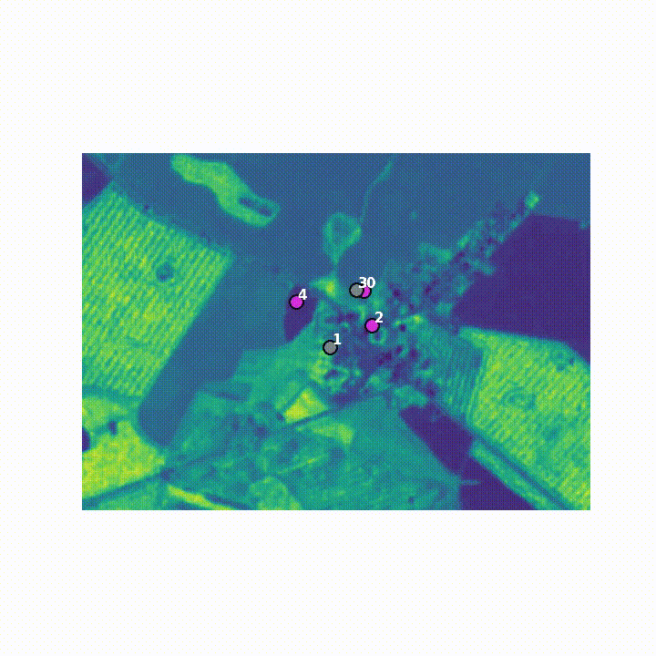

# PPO-driven Swarm Control  

### A Hybrid Multi-Robot Framework Combining Reinforcement Learning, Consensus, Potential Fields, and CRN-Based Role Switching

**Author:** Ayushman Mishra  
**GitHub:** https://github.com/aymisxx  

---

## Project Overview

This project presents a **hybrid swarm control framework** that fuses **reinforcement learning** with **classical multi-robot systems (MRS) theory** to achieve scalable, stable, and efficient multi-agent coverage.

A microscopic **PPO-based learned controller** handles local navigation using vegetation information derived from satellite imagery, while macroscopic coordination is enforced through:

- Artificial **potential fields**
- **Graph-based consensus** dynamics
- **CRN-inspired stochastic role switching**

The result is a swarm that is **adaptive, decentralized, collision-free, and theoretically grounded**.

---

## Application Context

The motivating application is **precision agriculture**:

- A vegetation-rich field is represented as a **normalized NDVI proxy** (VARI-based).
- Multiple UAVs (modeled as single-integrator agents) must **explore and cover the field efficiently**.
- Each location yields reward **only on first visit**, discouraging redundant exploration.

This setup naturally emphasizes:
- Coverage efficiency  
- Spatial dispersion  
- Redundancy reduction  
- Robust decentralized coordination  

---

### **Simulation Environment**

The custom made simulation environment used:
> https://github.com/aymisxx/MicroUAV-2D

---

## Core Contributions

### 1. PPO-Based Local Navigation
- Each agent observes a **128×128 local NDVI patch**
- A CNN-based PPO policy outputs motion commands
- Learns vegetation-seeking behavior without global knowledge

### 2. Artificial Potential Fields
- **Attraction** to high-NDVI regions  
- **Repulsion** from nearby agents (collision avoidance)  
- **Revisit penalty** to discourage redundant paths  

### 3. Graph-Based Consensus
- Local communication graph induces Laplacian dynamics
- Reduces swarm imbalance and excessive dispersion
- Guarantees asymptotic consensus under standard connectivity assumptions

### 4. CRN-Inspired Role Switching
Agents stochastically transition between roles:
- **Explorer**: PPO-dominant, fast exploration  
- **Surveyor**: balanced behavior  
- **Defender**: strong repulsion and consensus  
- **Idle**: low activity / recovery mode  

Role transitions depend on local density and coverage metrics, inspired by **Chemical Reaction Networks (CRNs)**.

---

## Mathematical Modeling

This project formulates swarm coverage as a **hybrid multi-agent control problem** over a vegetation field derived from satellite imagery. The framework combines:

1. a **VARI-based NDVI proxy field** as the task landscape,
2. a **single-agent PPO navigation policy** trained from local observations,
3. **multi-agent single-integrator swarm dynamics**,
4. **artificial potential fields** for coverage spread and collision avoidance,
5. **graph-based consensus** for decentralized coordination, and
6. **CRN-inspired stochastic role switching** for adaptive swarm heterogeneity.

The result is a decentralized swarm controller in which learning provides local intelligence, while classical multi-robot systems theory provides structure, safety, and coordination.

### 1) Vegetation Field as the Task Landscape

The environment is built from a satellite RGB image. Since true NDVI requires a near-infrared channel, the notebook uses a **VARI-based vegetation proxy** instead:

$$
\mathrm{VARI} = \frac{G - R}{G + R - B + \varepsilon}
$$

where:

- $R, G, B$ are the normalized red, green, and blue image channels,
- $\varepsilon$ is a small constant for numerical stability.

The resulting VARI map is clipped and normalized to $[0,1]$, producing a scalar field

$$
\phi(x,y) \in [0,1]
$$

that acts as the environment’s **vegetation / utility map**.

This normalized field is referred to throughout the project as the **NDVI proxy** or `ndvi_field`, and it serves three roles simultaneously:

- the source of reward,
- the local perceptual input seen by each drone,
- the global landscape over which the swarm spreads.

### 2) Single-Agent State, Observation, and Motion Model

Each drone is modeled as a **point agent** moving on a 2D grid over the vegetation field.

For an agent $i$, its position is

$$
p_i(k) =
\begin{bmatrix}
x_i(k) \\
y_i(k)
\end{bmatrix}
\in \mathbb{Z}^2
$$

at discrete time step $k$.

The single-agent action space is discrete:

- $0 \rightarrow$ up
- $1 \rightarrow$ right
- $2 \rightarrow$ down
- $3 \rightarrow$ left

This matches the notebook’s control abstraction and is explicitly tied to a **single-integrator motion model** in the project description.

At each step, the agent receives a local observation patch centered on its current position:

$$
o_i(k) \in \mathbb{R}^{1 \times 128 \times 128}
$$

This patch is a **128×128 local crop** of the NDVI proxy field, zero-padded near boundaries and returned as a single-channel image. Thus, each agent acts only on **local perceptual information**, not full-map omniscience.

### 3) Single-Agent Reward and Exploration Objective

A boolean visit-history map is maintained over the field. If agent $i$ moves into cell $(x,y)$, its reward is

$$
r_i(k) =
\begin{cases}
\phi(x,y), & \text{if cell } (x,y) \text{ is visited for the first time} \\
0, & \text{otherwise}
\end{cases}
$$

This first-visit reward structure is crucial. It means the objective is not merely “go toward green pixels,” but rather:

- seek high-value vegetation regions,
- avoid wasteful revisits,
- spread coverage across the environment.

So even before adding explicit swarm couplings, the reward already contains an implicit pressure toward **coverage efficiency** and **dispersion**.

### 4) PPO as the Microscopic Local Controller

A PPO policy is trained in the single-agent environment using the local NDVI patch observation. The learned policy produces a local motion proposal:

$$
a_i^{\mathrm{PPO}}(k) = \pi_\theta(o_i(k))
$$

where:

- $\pi_\theta$ is the trained PPO policy,
- $o_i(k)$ is the local 128×128 observation patch,
- $a_i^{\mathrm{PPO}}(k)$ is the action proposed by the learned controller.

Conceptually, this PPO component acts as the **microscopic instinct layer** of the swarm:

- it learns local vegetation-seeking behavior,
- it reacts to local gradients and coverage opportunities,
- it does not by itself reason about multi-agent coupling, global balance, or collision avoidance.

That is why PPO alone performs well for single-agent exploration, but degrades when scaled directly to many agents.

### 5) Multi-Agent Swarm State

Once lifted into the swarm setting, the system consists of $N$ drones:

$$
\mathcal{V} = \{1,2,\dots,N\}
$$

with positions

$$
p_i(k) =
\begin{bmatrix}
x_i(k) \\
y_i(k)
\end{bmatrix},
\qquad i \in \mathcal{V}
$$

All agents share:

- the same global vegetation field $\phi(x,y)$,
- a global visit-history / coverage map,
- decentralized local observations extracted from their own positions.

The swarm state at time $k$ is therefore the collection

$$
P(k) = \{p_1(k), p_2(k), \dots, p_N(k)\}
$$

along with coverage history, role assignments, and any consensus variables maintained locally by the agents.

### 6) How Each Agent Operates in the Hybrid Framework

At every swarm timestep, **each agent executes the same decentralized update pipeline**, but with its own local observation, neighborhood, and role.

For drone $i$, the hybrid update works as follows:

#### Step 1: Local PPO proposal

The agent extracts its local NDVI patch and computes

$$
a_i^{\mathrm{PPO}}(k)
$$

from the trained PPO policy.

#### Step 2: Potential-field correction

The agent computes a classical potential-field motion term

$$
a_i^{\mathrm{PF}}(k)
$$

which combines:

- attraction toward useful vegetation / high-value regions,
- repulsion from nearby drones,
- repulsion from already visited regions,
- local density-based dispersion pressure.

#### Step 3: Consensus correction
Using nearby neighbors in the interaction graph, the agent computes a consensus-driven adjustment

$$
a_i^{\mathrm{cons}}(k)
$$

that nudges it toward globally better-balanced swarm behavior.

#### Step 4: Role-based modulation
The agent’s current role $r_i(k)$ modifies the relative weight of PPO, potential fields, and consensus.

#### Step 5: Final hybrid action
The resulting action is a weighted blend:

$$ a_i^{\mathrm{hybrid}}(k) = w_i^{\mathrm{ppo}}(k)\,a_i^{\mathrm{PPO}}(k) + w_i^{\mathrm{pf}}(k)\,a_i^{\mathrm{PF}}(k) + w_i^{\mathrm{cons}}(k)\,a_i^{\mathrm{cons}}(k) $$

#### Step 6: State update
The agent then updates its position according to the single-integrator motion rule:

$$
p_i(k+1) = p_i(k) + a_i^{\mathrm{hybrid}}(k)
$$

subject to environment boundary clipping and any implementation-specific collision-avoidance adjustments.

So each drone is neither purely learned nor purely hand-coded. It is a **hybrid local controller** whose motion emerges from the combination of learned policy, safety/dispersion fields, graph coordination, and adaptive role logic.

### 7) Artificial Potential Field Model

The artificial potential field layer provides classical swarm structure. For each agent $i$, the potential-field action is built from attractive and repulsive terms:

$$
a_i^{\mathrm{PF}} = a_i^{\mathrm{att}} + a_i^{\mathrm{rep}}
$$

where the attractive part encourages movement toward useful terrain and the repulsive part discourages clustering and redundancy.

#### Attractive terms

These are associated with vegetation-rich / task-relevant regions. High NDVI zones act like useful potential valleys or targets.

#### Repulsive terms
Repulsion is applied against:

- nearby drones,
- already visited cells,
- dense local neighborhoods.

This layer is what gives the swarm its “don’t pile up like confused pigeons” behavior. PPO supplies desire, potential fields supply manners.

### 8) Graph-Based Consensus Dynamics

A local communication graph is built at each timestep. Two agents are connected if they lie within a communication radius $R$. This defines a time-varying interaction graph:

$$
\mathcal{G}(k) = (\mathcal{V}, \mathcal{E}(k))
$$

with neighbor set $\mathcal{N}_i(k)$ for each agent.

Each drone maintains a local scalar coordination variable $y_i(k)$, such as a local coverage score or imbalance metric. The notebook gives the consensus update in the standard Laplacian form:

$$
y_i(k+1)
=
y_i(k)
-
\epsilon
\sum_{j \in \mathcal{N}_i(k)}
\big(y_i(k) - y_j(k)\big)
$$

where $\epsilon > 0$ is the consensus step size.

This update reduces disagreement between neighboring agents. In motion terms, it helps the swarm:

- reduce imbalance,
- avoid fragmented behavior,
- spread more coherently,
- suppress local over-concentration.

So consensus is not just a bookkeeping layer. It acts as the swarm’s decentralized “social correction term.”

### 9) CRN-Inspired Role Switching

Each agent is also assigned a discrete role

$$
r_i(k) \in \{\text{Explorer}, \text{Surveyor}, \text{Defender}, \text{Idle}\}
$$

that evolves stochastically over time.

The notebook describes role evolution as:

$$
r_i(k+1) \sim P\big(r_i(k) \rightarrow r_i(k+1)\big)
$$

where the transition probabilities depend on local swarm state, such as:

- coverage,
- local density,
- NDVI conditions.

This CRN-inspired role process creates decentralized functional specialization.

#### Explorer
- high PPO weight,
- weak consensus influence,
- stronger drive for aggressive exploration.

#### Surveyor
- balanced behavior,
- moderate PPO and potential-field participation.

#### Defender
- stronger repulsion,
- stronger consensus participation,
- lower-speed stabilizing behavior.

#### Idle / Resupply
- weak motion or recovery-like tendency,
- can act as a low-activity state.

The key point is that **each agent does not always behave the same way**. Its role changes the hybrid controller weights, which lets the swarm adapt its behavioral composition over time.

### 10) Hybrid Per-Agent Control Law

Combining all layers, the per-agent motion command is modeled as

$$
u_i(k)
=
w_i^{\mathrm{ppo}}(k)\,u_i^{\mathrm{PPO}}(k)
+
w_i^{\mathrm{pf}}(k)\,u_i^{\mathrm{PF}}(k)
+
w_i^{\mathrm{cons}}(k)\,u_i^{\mathrm{cons}}(k)
$$

where the weights depend on the agent’s role and local context.

Typical qualitative behavior described in the notebook is:

- in promising, information-rich regions, PPO dominates,
- in crowded regions, repulsion and coverage structure dominate,
- under role switching, explorers become more RL-driven while defenders become more potential-field and consensus-driven.

Thus, the swarm controller is **adaptive at the level of each individual agent**, not just globally tuned once and left frozen.

### 11) Full Swarm Update Loop

Over a rollout horizon of \(T\) timesteps, the swarm evolves by repeating the following for all agents:

1. compute local PPO action,
2. compute potential-field correction,
3. compute consensus correction,
4. apply role-based weighting/modification,
5. update agent position,
6. update global visit / coverage map,
7. log swarm metrics and trajectories.

This produces a decentralized but coordinated swarm motion process:

$$
P(k+1) = \mathcal{F}\big(P(k), \phi, \mathcal{G}(k), r(k), \pi_\theta\big)
$$

where $\mathcal{F}$ represents the hybrid swarm update induced by learned policy, classical fields, graph coupling, and stochastic role transitions.

### 12) Metrics Used to Evaluate the Model

The notebook defines several swarm-level metrics to evaluate the resulting dynamics.

#### Coverage Ratio

$$
\mathrm{Coverage} = \frac{|V_{\mathrm{visited}}|}{|V_{\mathrm{total}}|}
$$

This measures how much of the field the swarm actually explores.

#### NDVI Gain
The total first-visit NDVI harvested over the episode measures how effectively the swarm seeks valuable terrain.

#### Redundancy Index
This captures revisit waste. High redundancy means poor dispersion and excessive overlap.

#### Consensus Error

$$
E(k) = \sum_{i=1}^{N} \big(y_i(k) - \bar{y}(k)\big)^2
$$

where $\bar{y}(k)$ is the swarm mean of the consensus variable.

This measures how well the swarm synchronizes its decentralized local state.

#### Spatial Dispersion
Pairwise agent distances and related spread measures quantify how well the swarm distributes itself spatially.

### 13) Why This Mathematical Model Fits the Project

This formulation is strong because it aligns three layers cleanly:

- **task landscape** through the NDVI proxy field,
- **local intelligence** through PPO,
- **swarm structure** through potential fields, consensus, and role switching.

It also stays honest about what the project is:

- a decentralized coverage-control framework,
- not a full aerodynamic UAV flight simulator,
- not a centralized planner,
- not pure RL chaos-ball.

The notebook and README both make the same central point: **raw PPO alone is insufficient for scalable swarm coordination**, while the hybrid model gives better coverage, lower redundancy, stronger spatial organization, and more interpretable collective behavior.

### 14) Modeling Summary

In compact form, the framework is:

#### Field model

$$
\phi(x,y) = \mathrm{normalized\ VARI\ proxy}
$$

#### Single-agent reward

$$
r_i(k) =
\begin{cases}
\phi(x_i(k), y_i(k)), & \text{first visit} \\
0, & \text{otherwise}
\end{cases}
$$

#### Agent state and motion

$$
p_i(k) =
\begin{bmatrix}
x_i(k) \\
y_i(k)
\end{bmatrix},
\qquad
p_i(k+1) = p_i(k) + u_i(k)
$$

#### Consensus update

$$
y_i(k+1)
=
y_i(k)
-
\epsilon
\sum_{j \in \mathcal{N}_i(k)}
\big(y_i(k) - y_j(k)\big)
$$

#### Role switching

$$
r_i(k+1) \sim P\big(r_i(k) \rightarrow r_i(k+1)\big)
$$

#### Hybrid per-agent controller

$$
u_i(k)
=
w_i^{\mathrm{ppo}}(k)\,u_i^{\mathrm{PPO}}(k)
+
w_i^{\mathrm{pf}}(k)\,u_i^{\mathrm{PF}}(k)
+
w_i^{\mathrm{cons}}(k)\,u_i^{\mathrm{cons}}(k)
$$

This is the mathematical backbone of the project’s decentralized swarm behavior: **learned local action, corrected by classical multi-agent structure, modulated by adaptive roles, and evaluated through coverage-centric metrics**.

---

## Experimental Validation

Five regimes are evaluated:

1. Single-agent PPO  
2. Multi-agent PPO (no coordination)  
3. PPO + Potential Fields  
4. PPO + PF + Consensus  
5. **Full Hybrid: PPO + PF + Consensus + Role Switching**

### Key Findings:
- Raw PPO swarms cluster and revisit excessively  
- Potential fields improve dispersion  
- Consensus reduces coverage imbalance  
- **Full hybrid controller achieves best coverage, lowest redundancy, and strongest spatial organization**

Metrics include:
- Coverage ratio  
- NDVI harvested  
- Redundancy index  
- Consensus error  
- Role distribution dynamics  

---

## Folder Structure

```
PPO-driven Swarm Control
├── data/
│   ├── field_satellite.jpg
│   └── ndvi_field.npy
├── models/
│   └── ppo_ndvi_drone.zip
├── results/
│  (trajectory plots)
├── report/
│   └── PPO_driven_Swarm_Control_Report.pdf
├── PPO_Driven_Swarm_Control (Notebook).ipynb
├── PPO_Driven_Swarm_Control (PDF).pdf
├── requirements.txt
└── README.md
```

The notebook (**PPO_Driven_Swarm_Control (Notebook).ipynb**) is **fully standalone and reproducible**, starting from NDVI extraction and ending with full swarm simulations. '**results**' contains the hybrid rollout trajectory video. '**report**' folder contains the project report.

---

## Dependencies

- Python 3.9+  
- NumPy  
- OpenCV  
- Matplotlib  
- Gymnasium  
- PyTorch  
- Stable-Baselines3  

GPU acceleration (CUDA) is supported but optional.

---

## How to Run

1. Place a satellite image in `data/field_satellite.jpg`
2. Open the notebook:
   ```bash
   PPO_driven_Swarm_Control (Notebook).ipynb
   ```
3. Run all cells sequentially:
   - NDVI generation
   - PPO training
   - Multi-agent hybrid simulation
4. Outputs (plots, GIFs, metrics) are saved to `results/`

If you wish to look at the project without running the notebook/codes, kindly open **PPO_Driven_Swarm_Control (PDF).pdf**

---

## Key Takeaway

This project demonstrates that **reinforcement learning alone is insufficient for scalable swarm coordination**.  
By embedding PPO inside a **theoretically grounded MRS framework**, we obtain:

> Learning with structure.  
> Adaptivity with guarantees.  
> Emergence without chaos.

---

## Results & Analysis

The proposed hybrid swarm-control framework was evaluated through extensive simulations on a vegetation-driven coverage task. Performance was analyzed by progressively enabling coordination layers on top of a PPO-based local controller.

### Experimental Regimes

Five control configurations were compared:

- Single-Agent PPO

- Multi-Agent PPO (no coordination)

- PPO + Potential Fields (PF)

- PPO + PF + Consensus

- Full Hybrid: PPO + PF + Consensus + CRN Role Switching

All experiments used identical NDVI fields, swarm sizes, episode lengths, and initialization distributions to ensure fair comparison.

### Final Hybrid Swarm Rollout

Hybrid swarm controller combining PPO policy with artificial potential fields, consensus dynamics, and stochastic role switching.



### Coverage Performance

- **Single-agent PPO** successfully learns vegetation-seeking behavior but is inherently limited in spatial coverage.
- **Multi-agent PPO without coordination** exhibits significant clustering and redundant trajectories, resulting in poor marginal gains as swarm size increases.
- **Potential field integration** improves agent dispersion and collision avoidance, increasing overall coverage.
- **Consensus dynamics** further balance spatial distribution, reducing over-exploration of local regions.
- The **full hybrid controller** achieves the highest coverage ratio by efficiently spreading agents across the environment while prioritizing high-NDVI regions.

### Redundancy & Dispersion

- **Raw PPO swarms** suffer from high revisit rates and overlapping trajectories.
- **Potential-field repulsion** significantly reduces close-proximity interactions.
- **Consensus terms** smooth swarm motion and prevent fragmentation.
- **CRN-based role switching** introduces functional heterogeneity, further reducing redundancy by dynamically reallocating agents to exploration-heavy or stabilization-focused roles.

**Overall, the full hybrid system consistently demonstrates the lowest redundancy index and the most uniform spatial dispersion.**

### Consensus Convergence

- Swarms with **consensus-enabled controllers** exhibit rapid decay of consensus error.
- Empirical convergence behavior aligns closely with **theoretical guarantees** derived from Laplacian-based analysis.
- Consensus improves **global coordination** without enforcing rigid formations, preserving exploration flexibility.

---

### Role Distribution Dynamics

- **CRN-inspired stochastic role switching** yields stable population-level role distributions.
- **Explorer agents** dominate early exploration phases, while **surveyor and defender roles** increase as local density and coverage rise.
- This adaptive redistribution improves **robustness** and prevents long-term stagnation.

---

### Qualitative Observations

Trajectory visualizations and time-lapse videos reveal clear qualitative differences:

- **PPO-only swarms** appear chaotic and locally greedy.
- **Hybrid swarms** exhibit smooth, structured, and interpretable collective motion.
- The **full hybrid controller** produces emergent behaviors such as territory splitting, wave-like dispersion, and coverage-front propagation.

> Minor boundary accumulation observed in earlier runs was found to be a transient effect of initialization and stochastic policy execution; upon rerunning the simulation with updated parameters, the swarm exhibited uniform coverage without persistent boundary clustering.

### Limitations

While the swarm exhibits strong dispersion and collision avoidance during early exploration, performance degrades over longer horizons. As coverage saturates and NDVI gradients weaken, PPO-driven actions can dominate the hybrid controller, reducing the effectiveness of fixed-gain potential-field repulsion. This occasionally leads to local clustering and near-collisions midway through the simulation.

Additionally, the learned PPO policy is not explicitly safety-aware and relies on classical control layers for collision avoidance. In dense regions, static potential-field gains and stochastic role switching may be insufficient to counter aggressive learned motions, suggesting the need for adaptive gain scheduling or safety-aware policy training in future work.

### Key Takeaways

- Reinforcement learning alone is insufficient for scalable swarm coordination.

- Classical MRS components provide structure, safety, and stability.

- PPO excels as a local intelligence module when embedded within a principled control architecture.

- The hybrid framework achieves robust, scalable, and interpretable swarm behavior.

---

# Citation

If you use or build upon this work / fork this work, please cite:

> Ayushman Mishra, *PPO-Driven Swarm Control: A Hybrid Multi-Robot Framework Combining Consensus, Potential Fields, and CRN-Based Role Switching*, github.com/aymisxx/PPO-driven-Swarm-Control

> Ayushman Mishra, *MicroUAV-2D: Lightweight 2D Down-Camera UAV Simulation Environment for Rapid Autonomy Prototyping*, github.com/aymisxx/MicroUAV-2D

---
