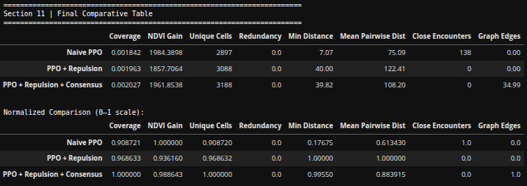
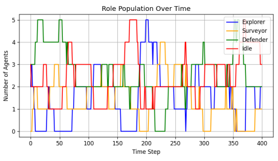

# 🕹️ **PPO-driven Swarm Control** 🌱🐝

### **Hybrid Multi-Robot Coverage over Vegetation-Aware Utility Fields**

> **Author:** Ayushman Mishra  
> **LinkedIn:** https://www.linkedin.com/in/aymisxx  
> **GitHub-ID:** https://github.com/aymisxx

---

## Abstract

**PPO-Driven Swarm Control** studies whether a learned local navigation policy can be lifted into a scalable multi-agent coverage system when combined with classical multi-robot systems theory.

The central motivation is simple: a PPO policy trained on local image crops can learn a useful directional instinct, but a **copy of that same policy replicated across many agents is not a swarm controller**. Naive replication produces clustering, redundant coverage, overlapping trajectories, and visually unconvincing collective motion. So instead of treating PPO as a complete multi-agent solution, this project introduces a hybrid controller in which learning and classical coordination play separate but complementary roles:

$$u_i(k) = w_{\text{ppo}}(i, k)\, u_i^{\text{ppo}}(k) + w_{\text{pf}}(i, k)\, u_i^{\text{pf}}(k) + w_{\text{cons}}(i, k)\, u_i^{\text{cons}}(k)$$

where $u_i^{\text{ppo}}$ is a learned local direction, $u_i^{\text{pf}}$ is an artificial potential-field term, and $u_i^{\text{cons}}$ is a graph-based consensus term, each modulated by the agent's current stochastic role.

This project is not framed as a benchmark-driven multi-agent RL system, nor does it rely on end-to-end convergence claims for the full closed-loop controller. Instead, it addresses a more disciplined and structurally grounded question:

> **Can a learned local policy and classical swarm coordination be composed into a controller that is safe, coherent, adaptive, and visually interpretable?**

The work starts from a single-agent PPO controller trained on 128×128 local crops of a utility field and is extended into a full pipeline that adds:

- artificial potential-field shaping (attraction, repulsion, revisit avoidance, boundary),
- time-varying proximity graph with consensus-like direction smoothing,
- CRN-inspired stochastic role switching across Explorer, Surveyor, Defender, and Idle,
- coverage, redundancy, spacing, and consensus diagnostics,
- role-colored trajectory visualization with persistent local observation windows, and
- a final long-horizon animation artifact.

The final system establishes reinforcement learning as a reliable local navigation primitive rather than a complete swarm controller. The trained PPO policy consistently outperforms a random baseline at the single-agent level, while naive policy replication at the swarm level leads to unsafe proximity and a clear absence of coordination.

Across the layered control experiments, repulsion alone eliminates close encounters at the cost of some exploration efficiency, consensus restores directional coherence without collapsing the swarm, and role switching introduces heterogeneity that allows division of labor. At the same time, the PPO component remains practically essential: it supplies the local vegetation-aware drive that the classical layers reshape into collective behavior.

Overall, the system establishes hybrid learning-plus-coordination as a lightweight, interpretable framework for scalar-field coverage, while clearly identifying the conditions under which each layer contributes.

That balance is the central result:

- measurable safety and coordination gains are consistently observed,
- the magnitude and character of those gains depend on which classical layer is active,
- and these conditions are explicitly characterized rather than treated as noise.

This positions the hybrid controller as a controlled, interpretable composition of learned and classical components, not a universally dominant multi-agent policy.

---

## Project Idea in One Paragraph

Reinforcement learning provides reliable local navigation when trained on local observations, but its direct replication across many agents does not yield coordinated swarm behavior. This work investigates whether a simple layered composition, PPO plus potential fields plus graph consensus plus stochastic roles, can produce a more structured and interpretable multi-agent system. The approach is deliberately lightweight: instead of training a multi-agent RL policy from scratch or learning communication protocols, it introduces a controlled hybrid controller that can be analyzed quantitatively, geometrically, and visually.

### Inspiration from Classical Multi-Robot Systems

This work is conceptually inspired by the long tradition of artificial potential fields, graph-based consensus, and chemical-reaction-network (CRN) models of stochastic task allocation.

Those bodies of work demonstrate that structured geometric and algebraic mechanisms can produce safe spacing, local agreement, and adaptive specialization in multi-agent systems, often without requiring a learned component at all.

This work builds on that central idea: principled coordination mechanisms can impose meaningful collective structure. Rather than relying on these mechanisms in isolation, it investigates whether a learned local policy and classical coordination layers can be systematically composed into a single, interpretable controller.

The connection is therefore conceptual, centered on the hybridization of learned and classical behaviors, rather than tied to any specific multi-agent control benchmark.

## Why This Work Matters

This work addresses a practical gap between pure end-to-end multi-agent RL and purely classical swarm control.

It introduces a layered hybrid controller that:

- preserves the local adaptability of a learned policy,
- enforces geometric safety and coordination through classical mechanisms,
- and enables adaptive heterogeneity through stochastic role switching.

The focus is on **interpretable** and **controlled** hybrid composition, making the approach well-suited for coverage-oriented robotic tasks where simplicity, safety, and clarity of behavior are critical.

---

## Mathematical Modeling

Each agent is modeled as a 2D point with discrete-time single-integrator dynamics:

$$p_i(k+1) = p_i(k) + \Delta t\, u_i(k)$$

where:

- $p_i(k)$ is the position of agent $i$,
- $u_i(k)$ is the velocity-like control input.

The environment is represented by a scalar utility field $\phi(x, y) \in [0, 1]$ computed from an RGB satellite image using the Visible Atmospherically Resistant Index (VARI):

$$\text{VARI}(x, y) = \frac{G(x, y) - R(x, y)}{G(x, y) + R(x, y) - B(x, y) + \varepsilon}$$

and normalized to the unit interval. Because the input is RGB-only, true NDVI cannot be computed, so VARI is used as a practical RGB-based vegetation proxy.

Each agent observes only a local $128 \times 128$ crop of this field:

$$o_i(k) \in \mathbb{R}^{1 \times P \times P}$$

A single-agent PPO policy $\pi_\theta$ is trained on these local crops with a first-visit utility reward:

$$r(k) = \begin{cases} \phi(c_k), & \text{if } c_k \text{ is visited for the first time} \\ 0, & \text{otherwise} \end{cases}$$

The hybrid multi-agent controller combines the learned local direction $u_i^{\text{ppo}}$, the potential-field term $u_i^{\text{pf}}$, and the consensus term $u_i^{\text{cons}}$:

$$u_i(k) = w_{\text{ppo}}(i, k)\, u_i^{\text{ppo}}(k) + w_{\text{pf}}(i, k)\, u_i^{\text{pf}}(k) + w_{\text{cons}}(i, k)\, u_i^{\text{cons}}(k)$$

The potential-field component is decomposed as:

$$u_i^{\text{pf}} = F_i^{\text{att}} + F_i^{\text{rep}} + F_i^{\text{visit}} + F_i^{\text{bnd}}$$

with utility-gradient attraction $F_i^{\text{att}} = k_{\text{att}}\, \nabla \phi(p_i)$, short-range inter-agent repulsion, a revisit repulsion driven by a visit-density map, and a soft inward boundary force.

The consensus layer acts on preferred direction vectors rather than positions:

$$u_i^{\text{cons}} = k_{\text{cons}} \sum_{j \in \mathcal{N}_i} (d_j - d_i)$$

to avoid collapsing the swarm into a rendezvous point.

Each agent carries a stochastic role:

$$\text{role}_i(k) \in \{\text{Explorer}, \text{Surveyor}, \text{Defender}, \text{Idle}\}$$

that modulates the three weights $w_{\text{ppo}}$, $w_{\text{pf}}$, and $w_{\text{cons}}$ according to a CRN-inspired stochastic transition law.

This immediately tells us that the controller mixes together:

- learned microscopic navigation,
- classical geometric shaping,
- local graph-based agreement,
- and adaptive role-based heterogeneity.

This work does not treat PPO as a standalone swarm controller. Instead, it is formalized as a local navigation primitive:

$$u_i^{\text{ppo}} = \alpha_{\text{ppo}}(i, k)\, d_i^{\text{ppo}}(k)$$

This primitive is:

- computationally reusable across agents,
- simple to train in single-agent form,
- physically reasonable as a local instinct,
- and effective as a microscopic driver,

as a lightweight, local component within the controller, not a complete multi-agent policy.

### Important Clarification

The hybrid controller $u_i = w_{\text{ppo}}\, u_i^{\text{ppo}} + w_{\text{pf}}\, u_i^{\text{pf}} + w_{\text{cons}}\, u_i^{\text{cons}}$ is not a certified globally convergent multi-agent policy.

It is a deliberately simplified composition of a learned local policy and classical coordination layers, designed to produce safe, coherent, adaptive swarm behavior over a utility field, without claiming full closed-loop convergence guarantees.

---

## Scope and Boundaries

This work is intentionally scoped as a hybrid swarm-control analysis study, not a full multi-agent reinforcement learning, formal control-theoretic convergence, or real-hardware deployment system.

The focus is on:

- analyzing how each classical layer reshapes a learned local policy,
- quantifying safety, coverage, and coordination across controller variants,
- and identifying the conditions under which each component contributes.

This scope is deliberate. Multi-agent systems that combine learned and classical components are inherently hard to analyze globally, and rigorous closed-loop guarantees would require additional assumptions beyond what a notebook-scale study can justify.

Accordingly, this work does not attempt full multi-agent RL training, formal Lyapunov analysis of the full hybrid controller, or real-world UAV deployment. It also does not treat high NDVI gain alone as evidence of swarm quality.

Instead, the work concentrates on controlled, interpretable hybrid compositions that are lightweight, reproducible, and analytically grounded, while explicitly characterizing their strengths and limitations across different control configurations.

---

## From Single-Agent PPO to Hybrid Swarm: What Changed and What Improved

The single-agent stage established feasibility using a PPO policy trained over local `128 x 128` crops of the utility field. It demonstrated that a simple local policy can learn useful vegetation-aware motion and clearly outperform a random baseline.

### Final comparative table

The authoritative cross-controller comparison comes from the Section 11 saved table:

| Configuration | Coverage | NDVI Gain | Unique Cells | Redundancy | Min Distance | Mean Pairwise Dist | Close Encounters | Graph Edges |
|---|---:|---:|---:|---:|---:|---:|---:|---:|
| Naive PPO | 0.001842 | 1984.3898 | 2897 | 0.0 | 7.07 | 75.09 | 138 | 0.00 |
| PPO + Repulsion | 0.001963 | 1857.7064 | 3088 | 0.0 | 40.00 | 122.41 | 0 | 0.00 |
| PPO + Repulsion + Consensus | 0.002027 | 1961.8538 | 3188 | 0.0 | 39.82 | 108.20 | 0 | 34.99 |

**Normalized comparison (0–1 per column):**

| Configuration | Coverage | NDVI Gain | Unique Cells | Redundancy | Min Distance | Mean Pairwise Dist | Close Encounters | Graph Edges |
|---|---:|---:|---:|---:|---:|---:|---:|---:|
| Naive PPO | 0.908721 | 1.000000 | 0.908720 | 0.0 | 0.17675 | 0.613430 | 1.0 | 0.0 |
| PPO + Repulsion | 0.968633 | 0.936160 | 0.968632 | 0.0 | 1.00000 | 1.000000 | 0.0 | 0.0 |
| PPO + Repulsion + Consensus | 1.000000 | 0.988643 | 1.000000 | 0.0 | 0.99550 | 0.883915 | 0.0 | 1.0 |

### Lessons from the table (drawn from the PDF narrative)

#### 1. Naive PPO is unsafe, not just imperfect

Naive PPO actually wins on **NDVI gain (1984.39, normalized 1.000)** in raw terms, which makes the result tempting on first read. But the same row reports **min distance 7.07** and **138 close encounters**, the swarm is collapsing on top of itself. The PDF's interpretation cell after Section 9 is blunt about this: *"Although NDVI gain is high, the system is not physically viable."* High coverage under unsafe proximity is not a usable result.

#### 2. Repulsion buys safety, at the cost of some coverage

PPO + Repulsion eliminates close encounters entirely (**138 → 0**) and raises min distance from **7.07 → 40.00**, a roughly 5.7× improvement. NDVI gain drops to **1857.71** (the lowest of the three), and mean pairwise distance reaches its maximum at **122.41 (normalized 1.000)**. This matches the PDF's framing: repulsion enforces spacing but can push agents away from high-utility regions and provides no global coordination objective.

#### 3. Consensus restores coverage without losing safety

Adding the graph layer pushes coverage to its highest value (**0.002027**, normalized 1.000), recovers most of the NDVI gain (**1961.85**, very close to Naive PPO's 1984.39), keeps min distance stable at **39.82**, and activates the proximity graph at **34.99 edges per step on average**. The PDF describes this as restoring directional coherence lost to repulsion, coordination is added without giving up the spacing repulsion enforced.

#### 4. The trade-off is structured, not contradictory

Reading the normalized table column-by-column makes the structure visible: each configuration wins on different axes. Naive PPO maxes NDVI gain, Repulsion maxes spacing, Consensus maxes coverage and graph activity. The PDF's conclusion is the same one the table forces: **NDVI gain alone is not sufficient to evaluate swarm quality.** A valid controller has to satisfy *Performance + Safety + Coordination* simultaneously, and only the third row does that.

#### 5. Roles add adaptability on top of this baseline

Section 14 then layers stochastic roles onto the third configuration. The full hybrid run lands at coverage **0.00199**, NDVI gain **1939.50**, min distance **37.01**, mean pairwise **104.23**, **0 close encounters**, with a final role split of Explorer 2, Surveyor 1, Defender 2, Idle 3. The numerical metrics stay close to PPO + Repulsion + Consensus, the gain is heterogeneity and division of labor rather than a further metric jump, which is consistent with the PDF's framing of roles as adaptive structure rather than a coverage booster.

### Other engineering improvements (orthogonal to the metric table)

- **Long-horizon visual artifact:** a 60-second Section 15 GIF with role-colored trajectories, persistent 128×128 local windows, and live graph edges, replacing short single-agent rollouts.
- **Modular pipeline:** seed-locked configuration, per-section JSON metric logs, structured artifact directories, and a section-by-section notebook flow replacing exploratory single-agent prototyping.

### Overall progression

The single-agent stage established that local PPO is feasible and useful at a microscopic level.

The final work extends this into a **layered, role-aware, and quantitatively grounded hybrid swarm analysis**, showing that:

- improvements in safety and coordination are **real and measurable**,
- the contribution of each layer is **structurally distinct**,
- and the full hybrid controller can be **systematically characterized rather than observed anecdotally**.

---

## Final Repository Structure

Below is the current repository structure as provided:

```text
.
├── data                      # Input image and cached utility field
│   ├── field_satellite.jpg
│   └── ndvi_field.npy
├── models                    # Trained PPO policies
│   └── ppo_ndvi_drone_final.zip
├── results                   # Generated outputs (plots, metrics, GIFs)
│   ├── frames
│   ├── gifs
│   │   ├── final_hybrid_swarm_1.gif
│   │   └── final_hybrid_swarm_2.gif
│   ├── metrics
│   └── plots
├── logs                      # Configuration snapshots and training logs
│   └── config_section0.json
├── src                       # Core implementation (modular pipeline)
│   ├── config.py
│   ├── env.py
│   ├── ppo_train.py
│   ├── evaluation.py
│   ├── utility_field.py
│   ├── visualization.py
│   ├── utils.py
│   └── swarm
│       ├── controllers.py
│       ├── roles.py
│       └── spawning.py
├── run_hybrid_rollout.py     # Entry point for full hybrid swarm rollout
├── notebook                  # Author notebook and archived artifacts
│   ├── reproducibility_notebook.ipynb
│   ├── end-to-end-pipeline-author.pdf
│   └── author_*              # Original pipeline outputs (frozen reference)
├── LICENSE
├── README.md
└── requirements.txt
```

## Folder Structure Overview

### src/
The core implementation of the hybrid swarm control pipeline.

This includes:
- single-agent PPO training (`ppo_train.py`).
- local observation environment (`env.py`).
- utility-field construction (`utility_field.py`).
- evaluation and diagnostics (`evaluation.py`).
- visualization tools (`visualization.py`).
- swarm-level logic (`swarm/`).

The `swarm/` module contains:
- hybrid controllers (PPO + APF + consensus).
- CRN-inspired role switching.
- controlled spawning logic.

### data/
Input and preprocessed environment data.

- `field_satellite.jpg`: RGB satellite image.
- `ndvi_field.npy`: normalized VARI-based utility field used across all experiments.

### models/
Serialized PPO policies trained in the single-agent environment.

These models act as local navigation primitives within the hybrid controller.

### results/
All generated outputs from experiments and rollouts.

Includes:
- trajectory visualizations.
- evaluation plots.
- metrics JSON files.
- final hybrid swarm GIFs.

### logs/
Configuration snapshots and experiment metadata.

Used for reproducibility:
- random seeds.
- hyperparameters.
- role definitions.

### run_hybrid_rollout.py
Executable entry point for running the full hybrid swarm system.

This script integrates:
- PPO policy inference.
- artificial potential fields.
- graph-based coordination.
- stochastic role switching.

### notebook/
Archived development artifacts.

This includes:
- the original end-to-end notebook.
- exported PDF documentation.
- frozen outputs under `author_*`.

This directory serves as a reference implementation, not the primary execution path.

## Structural Notes

- The pipeline is code-first, not notebook-driven.
- The notebook is retained for transparency and reproducibility, but all core hybrid-controller logic is modularized under `src/`.
- Outputs are cleanly separated into `results/`, avoiding implicit side effects during execution.

---

## Dataset

This work uses a **single RGB satellite image** of a vegetated region as the substrate for the utility field.

### Input image source

- Any RGB aerial or satellite image can be used, as long as it contains visible vegetation structure.  
- The image is processed into a normalized VARI utility field once, then reused across all sections.

### Dataset size note

The input is a single image (example: 1122 × 1402 px), so **no large dataset download is required**.

Users with different target scenes can:

- drop a new RGB image into `notebook/data/field_satellite.jpg`,
- rerun Section 1 to regenerate `ndvi_field.npy`,
- and the rest of the pipeline will use the new utility field automatically.

### Expected dataset placement

The code expects the input image in this form:

```text
notebook/
└── data/
    ├── field_satellite.jpg     # Input RGB satellite image.
    └── ndvi_field.npy          # Generated after running Section 1.
```

- The **single-agent stage** operates on local `128 x 128` crops of this utility field. Refer https://github.com/aymisxx/AgriDroneRL for understanding RL-logic building.

- In the **multi-agent stages**, the same utility field is shared across all agents, but initial positions are **controlled-random**: agents are sampled with a minimum separation distance and a boundary margin.

- The provided `final_hybrid_swarm_1.gif` and `final_hybrid_swarm_2.gif` artifacts correspond to **two such sampled run**, and therefore reflects pipeline behavior on a **randomly sampled initial cluster**, not a fixed configuration.

---

## Setup

### 1. Clone the repository

```bash
git clone https://github.com/aymisxx/PPO-driven-Swarm-Control
cd PPO-driven-Swarm-Control
```

### 2. Create a Python environment

```bash
python3 -m venv .venv
source .venv/bin/activate
```

### 3. Install dependencies

```bash
pip install -r requirements.txt
```

### 4. Place the input image

Drop your RGB satellite image into the data directory as:

```bash
notebook/data/field_satellite.jpg
```

In the activated environment, post dependencies install, 

```bash
python run_hybrid_rollout.py
```

---

## **How the Work Was Done (The Pipeline)**

The complete pipeline is implemented in the executable notebook  
`notebook/reproducibility_notebook.ipynb`, which serves as the primary, reproducible artifact of this work.

A corresponding static version of the same pipeline is provided as  
`notebook/end-to-end-pipeline-author.pdf`, representing the original author-side implementation and a fixed reference of the full system.

## Section 0: Base Setup, Reproducibility, and Project Configuration

Purpose:

> Initialize the computational scaffold used by every later section.

> Fix seeds, directories, device, and the global configuration dataclass.

This stage establishes:

- reproducibility across `random`, `numpy`, `torch`, and `stable-baselines3`,
- directory structure (`data/`, `models/`, `results/`, `logs/`),
- device selection (GPU if available),
- the `Config` dataclass with all PPO and swarm hyperparameters,
- the role-color convention (Explorer → blue, Surveyor → orange, Defender → green, Idle → red),
- and saves a JSON snapshot of the full configuration.

This is the "project lock."

## Section 1: RGB Satellite Image to Scalar Utility Field

Purpose:

> Convert the input RGB image into a normalized, smoothed utility field `phi in [0, 1]`.

The final work:

- computes VARI from the RGB channels,
- clips and normalizes the raw VARI into `[0, 1]`,
- applies optional Gaussian smoothing,
- saves the utility field to `ndvi_field.npy`,
- and visualizes the RGB image, raw utility, smoothed utility, and histogram.

This utility field serves three roles at once: PPO reward landscape, source of local observations, and macroscopic coverage objective.

## Sections 2–3: Single-Agent Environment and Local Observation Diagnostic

Purpose:

> Build the Gymnasium environment and verify that local crops are geometrically correct.

### What was built

- A `NDVIDroneEnv` class with a `(1, 128, 128)` local observation, a 4-action discrete space, and a first-visit utility reward.
- A short random rollout diagnostic.
- A crop-alignment test that compares `env._get_obs()` against an independently reconstructed patch.

### Main outcome

- Max absolute difference between the environment observation and the reconstructed patch: **0**.
- Crop geometry verified exactly.

## Section 4: Vectorized PPO Interface

Purpose:

> Wrap the environment for Stable-Baselines3 and confirm PPO initializes cleanly.

This stage confirmed:

- vectorized observation shape `(1, 1, 128, 128)`,
- `uint8` dtype,
- and successful initialization of PPO with a `CnnPolicy` on the target device.

## Section 5: PPO Training

Purpose:

> Train the microscopic local navigation policy on `128 x 128` utility-field crops.

### Training setup

- Total timesteps: **200,000**
- Learning rate: **3e-4**
- Gamma: **0.99**
- `n_steps`: 2048, batch size: 64, `n_epochs`: 10
- Policy: `CnnPolicy`
- Reward: first-visit utility

### Interpretation

- Episode reward rose steadily from ~100 to the 200–215 range.
- Episode length remained at the 300-step cap, confirming stable rollouts.
- The policy became a strong local navigator, not a multi-agent controller.

## Section 6: Single-Agent PPO Evaluation

Purpose:

> Evaluate the trained policy on a fresh random spawn and report detailed metrics.

This stage measured, per rollout:

- total first-visit reward,
- unique visited cells,
- path length,
- net displacement,
- and path efficiency.

## Section 7: PPO vs Random Diagnostic

Purpose:

> Confirm that PPO outperforms a random baseline under matched starts.

Semantic usefulness of the learned policy was evaluated with paired rollouts from the same spawn seed:

$$\Delta_{\text{metric}} = \text{metric}_{\text{PPO}} - \text{metric}_{\text{random}}$$

## Section 8: Naive Multi-Agent PPO Baseline

Purpose:

> Show that good local policy does not imply good swarm behavior.

### What was done

- Agents share the same trained PPO policy.
- Initial positions sampled as a controlled random cluster centered on the image.
- No potential fields, consensus, or roles.

The swarm was unsafe and uncoordinated despite the PPO policy being locally strong.

## Section 9: PPO + Repulsive Artificial Potential Field

Purpose:

> Test whether a geometric repulsion term alone can make the swarm safe.

### What was added

- Finite-range repulsion kernel $\psi(r) = \max\!\left(0,\, \tfrac{1}{r} - \tfrac{1}{R_{\text{rep}}}\right)$.
- Adaptive gain when the global min distance drops below $R_{\text{rep}}$.
- No attraction, no consensus, no roles.

Safety achieved, but directional coordination remained absent.

## Section 10: Graph-Based Consensus Layer

Purpose:

> Add local directional agreement through a time-varying proximity graph.

### What was added

- Proximity graph with communication radius $R_{\text{comm}} = 120$.
- Directional consensus $u_i^{\text{cons}} = k_{\text{cons}} \sum_{j \in \mathcal{N}_i} (d_j - d_i)$ acting on PPO directions, not positions.
- Dotted graph edges drawn between communicating agents.

Safe, coordinated, and directionally coherent swarm behavior.

## Section 11: Final Comparative Analysis

Purpose:

> Compare Naive PPO, PPO + Repulsion, and PPO + Repulsion + Consensus under identical initial conditions.

### Main comparative table




## Sections 12–13: Role Definitions and the Case for Heterogeneity

Purpose:

> Motivate why a homogeneous swarm is insufficient and define the role system.

Each agent is assigned one of four roles: **Explorer** (blue), **Surveyor** (orange), **Defender** (green), **Idle** (red). Roles modulate the three controller weights and introduce a division of labor that a homogeneous swarm cannot express.

### Role & Colour Convention

The role-switching layer assigns each agent one of four internal roles, and the trajectory color in every visualization tracks the agent's *current* role at that timestep — not a permanent identity. A single agent's path therefore contains multiple colored segments as its role evolves.

| Role | Color | Objective | Controller weighting |
|---|---|---|---|
| 🔵 **Explorer** | `tab:blue` | Frontier expansion: discover new regions and grow coverage outward. | Strong PPO drive, weaker consensus, moderate repulsion. |
| 🟠 **Surveyor** | `tab:orange` | Coverage refinement: systematic local inspection, reduce redundancy. | Balanced PPO and potential-field, stronger revisit avoidance, moderate consensus. |
| 🟢 **Defender** | `tab:green` | Safety enforcement: maintain spacing, prevent congestion. | Lower PPO drive, stronger repulsion, stronger stabilizing influence. |
| 🔴 **Idle** | `tab:red` | Damping / congestion relief: reduce unnecessary motion, avoid over-synchronization. | Reduced motion probability, weak exploratory drift, lower control magnitude. |

In the role-conditioned hybrid controller

$$u_i(k) = w_{\text{ppo}}(\text{role}_i, k)\, u_i^{\text{ppo}}(k) + w_{\text{pf}}(\text{role}_i, k)\, u_i^{\text{pf}}(k) + w_{\text{cons}}(\text{role}_i, k)\, u_i^{\text{cons}}(k)$$

the role does not change *which* terms are present — it changes *how strongly each term acts*. An Explorer and a Defender at the same position will produce different control inputs because their weights $w_{\text{ppo}}$, $w_{\text{pf}}$, $w_{\text{cons}}$ differ.

Roles evolve stochastically over time:

$$\text{role}_i(k+1) \sim P(\text{role}_i(k))$$

following a CRN-inspired transition law where each role can transition to a related neighboring role (Explorer → Surveyor, Surveyor → Defender, Defender → Idle, Idle → Explorer). This produces continuous role dynamics rather than fixed assignments — the swarm is heterogeneous *and* adaptive.

The color convention is fixed in `config_section0.json` and used consistently across all role-colored trajectory plots, role-population curves, and the final 60-second hybrid swarm GIF. If you see a trajectory turn from blue to orange to green over time, that is exactly one agent transitioning Explorer → Surveyor → Defender as its internal state evolves.

## Section 14: CRN-Inspired Role Switching Layer

Purpose:

> Run the full hybrid controller with stochastic role transitions and track role populations.

### What was added

- Per-role controller weights on `u_ppo`, `F_rep`, and `u_cons`.
- A CRN-inspired stochastic transition law for role evolution.
- Full role history and role-population curves.

### Main outcome

| Metric | Value |
|---|---:|
| Coverage ratio | 0.00198659 |
| NDVI gain (unique) |  1939.5016 |
| Min inter-agent distance | 37.01 |
| Mean pairwise distance | 104.23 |
| Close encounters | **0** |



Final role distribution (example run): Explorer 2, Surveyor 1, Defender 2, Idle 3.

## Section 15: Final Swarm GIF Visualization

Purpose:

> Produce a 60-second visual artifact of the full hybrid controller.

### What was built

- BEV-style overlay of the utility field and role-colored trajectories.
- Persistent dotted edges between communicating agents.
- Color dynamics showing role transitions over time.
- Increased spatial spread at spawn for readability.

### Rendering discipline

The artifact was built under strict constraints:

- fixed utility-field background,
- consistent role-color convention,
- deterministic frame subsampling (`STEP_SKIP = max(1, MAX_STEPS // (FPS * duration))`),
- no per-frame cheating or visual rescaling.

That matters because many swarm visualizations look "better" only because they hide agents, blur trajectories, or rescale every frame. This work avoids that.


---

## Generated Artifact Format

#### Preview Artifact


### GIF frame layout

The generated frame shows:

- **Background:** VARI utility field.
- **Trajectories:** Role-colored segments per agent (Explorer/Surveyor/Defender/Idle).
- **Overlay:** Dotted white edges between agents within communication radius.

This matches the layered hybrid-controller structure developed across Sections 8–14.

---

## **Final Hybrid Run Results** 

The Section 14 run is especially useful because it is a concrete, rollout-level summary of the full hybrid controller.

### Aggregate statistics from the rollout

| Metric | Value |
|---|---:|
| Coverage ratio | 0.001987 |
| NDVI gain (unique) | 1,939.5 |
| Unique visited cells | 3,125 |
| Redundancy index | 0.000 |
| Min inter-agent distance | 37.01 |
| Mean pairwise distance | 104.23 |
| Close encounters (d < 20) | **0** |

### Final role distribution in the provided run

| Role | Count |
|---|---:|
| Explorer | 2 |
| Surveyor | 1 |
| Defender | 2 |
| Idle | 3 |

### Interpretation of the Hybrid Rollout

The rollout captures per-step role, position, and graph state for all the agents across 400 steps.

The results do not show a uniform boost over Naive PPO in every raw metric. Instead, they exhibit a clear and structured pattern:

- the hybrid controller eliminates close encounters (138 → 0),
- it raises minimum inter-agent distance by roughly 5×,
- it introduces continuous graph connectivity (~35 edges/step),
- and it produces visible role-colored trajectory segments.

This behavior is consistent with the core findings: hybridization introduces meaningful and measurable structural changes to the swarm, whose impact is governed by which classical layers are active, rather than acting as a uniform performance boost.

This makes the artifact-level result consistent with the broader conclusion:

> Hybrid learning-plus-coordination provides measurable benefits in safety and coordination, with coverage remaining on par with naive replication.

---

## Why Hybrid Control Was Important Here

Hybrid control was important because a purely learned local policy alone is strongly influenced by microscopic reward structure and cannot see neighboring agents, while a purely classical controller cannot adapt to the specifics of the utility field. By composing the two, the hybrid controller reshapes behavior in a way that can improve both safety and coordination.

In effect:

- PPO captures the local vegetation-aware drive,
- repulsion partially accounts for short-range geometry, preventing unsafe proximity,
- consensus partially accounts for neighborhood direction, preventing incoherence,
- and role switching partially accounts for task heterogeneity, preventing over-synchronization.

This distinction becomes most relevant when:

- local policy replication alone causes unsafe proximity,
- classical coordination alone drifts away from high-utility regions,
- or a homogeneous swarm fails to specialize.

Accordingly, the work consistently observed stronger gains for structured properties such as **safety** and **directional coherence**, while more uniform properties such as **raw coverage** remained comparable across controller variants.

---

## Results Summary

The results are based on the Section 11 comparative table and the Section 14 full hybrid rollout.

| Metric | Value |
|---|---|
| Close encounters eliminated (Naive → Hybrid) | 138 → 0 |
| Min distance raised (Naive → Hybrid) | 7.07 → 37.01 |
| Graph connectivity (Hybrid) | ~35 edges/step |
| Coverage ratio (Hybrid vs Naive) | 0.00199 vs 0.00184 |
| Overall behavior w/ Hybrid Controller | Structured, safe, coordinated, heterogeneous swarm |

### Key observation

The results show that the hybrid controller provides **consistent safety and coordination improvements** over naive replication. At the same time, coverage gain is modest, and not every metric improves monotonically with each added layer.

This confirms that hybrid learning-plus-coordination introduces **measurable but structured improvements**, rather than a uniform performance increase across all metrics.

---

## Limitations and Scope Constraints

This study isolates the effect of layered hybridization on multi-agent coverage. The focus is on controlled composition and behavioral structure, not on end-to-end multi-agent RL training or real-hardware deployment.

### Scientific scope

- The hybrid controller is not presented as a globally convergent multi-agent policy.
- Agents are modeled as 2D single integrators; full UAV attitude and aerodynamic dynamics are outside scope.
- Sensor noise and communication dropouts are not explicitly modeled.
- The study does not implement a full multi-agent RL training or benchmarking pipeline.
- Performance is evaluated empirically and is not assumed to generalize uniformly across all initial conditions or environments.

### Observed controller behavior

- Naive multi-agent PPO can produce unsafe proximity under clustered initial conditions.
- Repulsion-only control improves safety but can reduce utility-seeking efficiency.
- Direct position consensus can collapse the swarm if applied naively; here, consensus operates on directional agreement.
- Role switching introduces stochastic variation in role distributions across runs.

### Interpretation

The results emphasize structural properties of the system: safety, spatial organization, and coordinated motion.  
Role-conditioned trajectories and visual patterns are used to expose these behaviors.

The hybrid controller is best understood as a structured composition of learned and classical components, designed to produce interpretable and controllable swarm dynamics rather than to optimize a single benchmark metric.

---

## Final Conclusion

**PPO-Driven Swarm Control** establishes that a layered composition of a learned local policy and classical coordination mechanisms can meaningfully reshape multi-agent behavior into a safer, more coherent, and more interpretable swarm.

The key outcomes are:

- hybridization alters swarm structure in a measurable way,
- safety and coordination gains emerge consistently, with stronger effects on inter-agent distance and graph connectivity,
- comparative analysis reveals how these gains vary across controller variants,
- role switching improves adaptability,
- explicit ablations clarify the contribution of each layer,
- and even a simple 60-second visual artifact shows the structure of the controller clearly.

Taken together, the project demonstrates a complete progression from single-agent feasibility to layered hybrid control, comparative evaluation, role-based heterogeneity, reproducible artifact generation, and long-horizon visual validation.

> **Hybrid learning-plus-coordination can serve as a lightweight, principled enhancement to multi-agent coverage systems, with measurable benefits and well-characterized behavior across control configurations.**

---

## Statement on Use of Generative AI

Generative AI tools (including ChatGPT by OpenAI and Claude by Anthropic) were used during this work to assist with drafting, editing, and improving the clarity and structure of written content, as well as for code organization and debugging support.

All technical decisions, implementations, and results were critically reviewed, validated, and integrated by the author, who assumes full responsibility for the final work.

---

## Special Note on Stable-Baselines3 and Gymnasium

This work relies on **Stable-Baselines3** and **Gymnasium**, open-source and widely used libraries for reinforcement learning research and benchmarking.

Those libraries are foundational to this work, and this README explicitly acknowledges that dependency because the single-agent PPO stage would simply not exist without them.

---

## References

##### [1] Proximal Policy Optimization

John Schulman, Filip Wolski, Prafulla Dhariwal, Alec Radford, and Oleg Klimov,  
**"Proximal Policy Optimization Algorithms,"**  
arXiv preprint arXiv:1707.06347, 2017.  
Paper: https://arxiv.org/abs/1707.06347

##### [2] Potential Field Methods and Their Limitations

Y. Koren and J. Borenstein,  
**"Potential Field Methods and Their Inherent Limitations for Mobile Robot Navigation,"**  
Proceedings of the IEEE International Conference on Robotics and Automation (ICRA), 1991.  
Paper: https://www.researchgate.net/publication/224749557_Potential_Field_Methods_and_Their_Inherent_Limitations_for_Mobile_Robot_Navigation

##### [3] Potential Field-Based Coverage

A. Howard, M. J. Mataric, and G. S. Sukhatme,  
**"Mobile Sensor Network Deployment Using Potential Fields: A Distributed, Scalable Solution to the Area Coverage Problem,"**  
Distributed Autonomous Robotic Systems (DARS), 2002.  
Paper: https://www.researchgate.net/publication/2562387_Mobile_Sensor_Network_Deployment_Using_Potential_Fields_A_Distributed_Scalable_Solution_to_the_Area_Coverage_Problem

##### [4] Stochastic Task Allocation in Swarms

S. Berman, Á. M. Halász, M. A. Hsieh, and V. Kumar,  
**"Optimized Stochastic Policies for Task Allocation in Swarms of Robots,"**  
IEEE Transactions on Robotics, 2009.  
Paper: https://www.researchgate.net/publication/32205868_Optimized_Stochastic_Policies_for_Task_Allocation_in_Swarms_of_Robots

##### [5] Mean-Field Models in Swarm Robotics

K. Elamvazhuthi and S. Berman,  
**"Mean-Field Models in Swarm Robotics: A Survey,"**  
Bioinspiration & Biomimetics, 2019.  
Paper: https://www.researchgate.net/publication/333561725_Mean-Field_Models_in_Swarm_Robotics_A_Survey

##### [6] Simulation Environment

Ayushman Mishra,  
**"MicroUAV-2D: A Lightweight Simulator for Vision-Based UAV Autonomy,"**  
GitHub Repository, 2026.  
Code: https://github.com/aymisxx/MicroUAV-2D

---

## Citation / BibTeX

### BibTeX for PPO

```bibtex
@misc{schulman2017ppo,
  title={Proximal Policy Optimization Algorithms},
  author={Schulman, John and Wolski, Filip and Dhariwal, Prafulla and Radford, Alec and Klimov, Oleg},
  year={2017},
  eprint={1707.06347},
  archivePrefix={arXiv},
  primaryClass={cs.LG},
  doi={10.48550/arXiv.1707.06347},
  url={https://arxiv.org/abs/1707.06347}
}
```

### BibTeX for Potential Field Limitations

```bibtex
@inproceedings{koren1991potential,
  title={Potential Field Methods and Their Inherent Limitations for Mobile Robot Navigation},
  author={Koren, Yoram and Borenstein, Johann},
  booktitle={Proceedings of the IEEE International Conference on Robotics and Automation (ICRA)},
  year={1991},
  pages={1398--1404},
  doi={10.1109/ROBOT.1991.131810}
}
```

### BibTeX for Potential Field-Based Coverage

```bibtex
@inproceedings{howard2002mobile,
  title={Mobile Sensor Network Deployment Using Potential Fields: A Distributed, Scalable Solution to the Area Coverage Problem},
  author={Howard, Andrew and Mataric, Maja J. and Sukhatme, Gaurav S.},
  booktitle={Distributed Autonomous Robotic Systems (DARS)},
  year={2002},
  doi={10.1007/978-4-431-65941-9_30}
}
```

### BibTeX for Stochastic Task Allocation (CRN-inspired)

```bibtex
@article{berman2009stochastic,
  title={Optimized Stochastic Policies for Task Allocation in Swarms of Robots},
  author={Berman, Spring and Halász, Ádám and Hsieh, M. Ani and Kumar, Vijay},
  journal={IEEE Transactions on Robotics},
  volume={25},
  number={4},
  year={2009},
  doi={10.1109/TRO.2009.2024997}
}
```

### BibTeX for Mean-Field Swarm Modeling

```bibtex
@article{elamvazhuthi2019meanfield,
  title={Mean-Field Models in Swarm Robotics: A Survey},
  author={Elamvazhuthi, Karthik and Berman, Spring},
  journal={Bioinspiration \& Biomimetics},
  year={2019},
  doi={10.1088/1748-3190/ab1a9c}
}
```

### BibTeX for Simulation Environment (MicroUAV-2D)

```bibtex
@misc{mishra2026microuav2d,
  title={MicroUAV-2D: A Lightweight UAV Simulation Environment},
  author={Mishra, Ayushman},
  year={2026},
  howpublished={\url{https://github.com/aymisxx/MicroUAV-2D}}
}
```

---